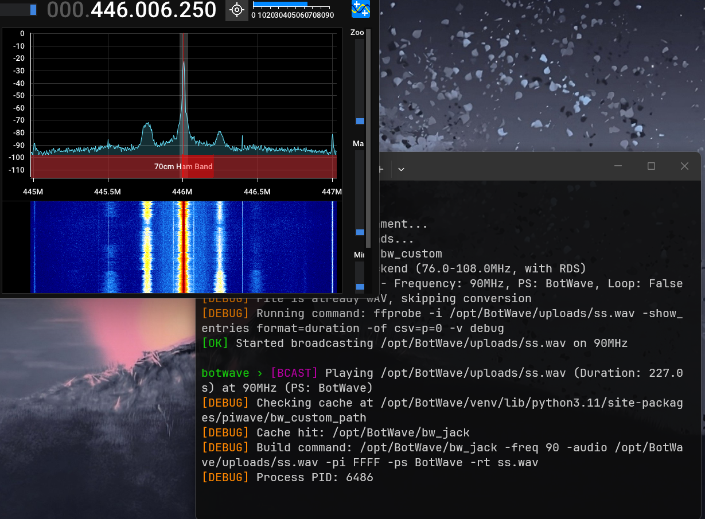

# bw_jack

ALSA audio backend for [BotWave](https://github.com/dpipstudio/botwave).

Instead of the default `bw_custom` backend (which streams via GPIO FM + RDS), `bw_jack` routes audio directly through the system's ALSA/JACK output. Originally built to pipe audio into a walkie-talkie on a Raspberry Pi 3B, but works with anything ALSA can talk to.

<div align="center">


> Audio being broadcasted with a talkie walkie using bw_jack
</div>

## Build

```bash
gcc bw_jack.c -o bw_jack -lasound -lsndfile
```

## Install

### 1. Place the binary

```bash
sudo mkdir -p /opt/BotWave/backends/bw_jack
sudo cp bw_jack /opt/BotWave/backends/bw_jack/bw_jack
```

### 2. Clear PiWave's path cache

PiWave (the backend manager) caches the backend path in two places. Both need to be removed or it'll keep pointing to `bw_custom`:

```bash
sudo rm -f /opt/BotWave/backend_path
sudo rm -f /opt/BotWave/venv/lib/python3.11/site-packages/piwave/bw_custom_path
```

> The `python3.11` part depends on your Python version. If the above fails, find the right path with:
> ```bash
> find /opt/BotWave/venv -name "bw_custom_path"
> ```

## Configure

### 3. Point BotWave at the new backend

Run the local BotWave shell:

```bash
sudo bw-local
```

Then inside the shell, set the path and do a dummy start to force the cache to refresh:

```
set bwcustom_path /opt/BotWave/backends/bw_jack/bw_jack
start <any audio file>
```

That's it, the path is now stored. You don't need to run `set` again after this.

## Usage

`bw_jack` is invoked by BotWave automatically, but you can also run it standalone:

```
bw_jack -audio <file|-> [-rate N] [-channels N] [-loop] [-raw]
```

| Flag | Default | Description |
|---|---|---|
| `-audio <path>` | *(required)* | Audio file to play, or `-` to read from stdin |
| `-rate N` | `48000` | Sample rate (stdin/raw mode only) |
| `-channels N` | `2` | Channel count (stdin/raw mode only) |
| `-loop` | off | Loop the file indefinitely |
| `-raw` | off | Treat file as raw S16LE PCM (skip libsndfile) |

**Examples:**

```bash
# Play a WAV file
./bw_jack -audio track.wav

# Loop an MP3
./bw_jack -audio jingle.mp3 -loop

# Stream raw PCM from stdin (e.g. from ffmpeg)
ffmpeg -i input.mp3 -f s16le -ar 48000 -ac 2 - | ./bw_jack -audio -
```

## Device

Hardcoded to `plughw:0,0`. If your setup uses a different ALSA device, change `DEVICE` at the top of `bw_jack.c` before building.

## Dependencies

- `libasound2-dev` (ALSA)
- `libsndfile1-dev` (audio file decoding)

```bash
sudo apt install libasound2-dev libsndfile1-dev
```

## License
Licensed under [GPLv3.0](LICENSE)