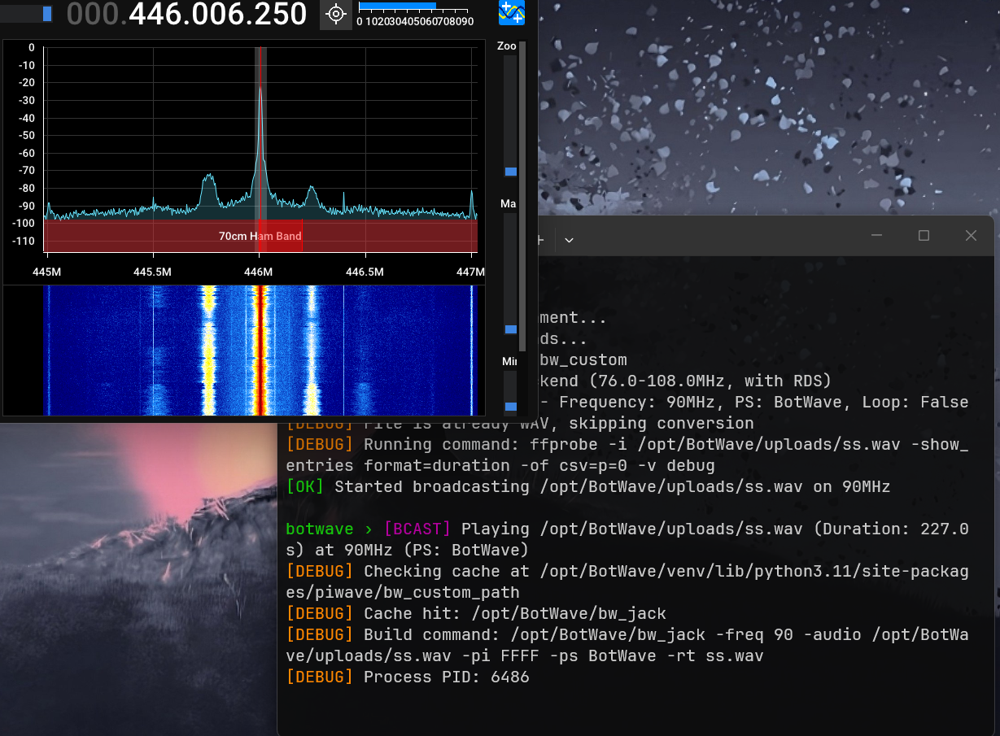

# bw_jack

ALSA audio backend for [BotWave](https://github.com/dpipstudio/botwave).

Instead of the default `bw_custom` backend (which streams via GPIO FM + RDS), `bw_jack` routes audio directly through the system's ALSA/JACK output. Originally built to pipe audio into a walkie-talkie on a Raspberry Pi 3B, but works with anything ALSA can talk to.

<div align="center">


> Audio being broadcasted with a talkie walkie using bw_jack
</div>

## Build & Dependencies

### Prerequisites

Install the required development libraries:

```bash
sudo apt install libasound2-dev libsndfile1-dev

```

### Compilation

Compile the source code using `gcc`:

```bash
gcc bw_jack.c -o bw_jack -lasound -lsndfile

```

## Installation & Configuration

### 1. Place the Binary

Move the compiled binary to the BotWave backends directory:

```bash
sudo mkdir -p /opt/BotWave/backends/bw_jack
sudo cp bw_jack /opt/BotWave/backends/bw_jack/bw_jack

```

### 2. Register & Update the Backend Cache

To configure `bw_jack`, you must force BotWave to bypass its cache and register the new binary path during a broadcast session.

Run the following command to start `bw-local` with the required environment variables:

```bash
BACKEND_BYPASS_CACHE=true BACKEND_PATH=/opt/BotWave/backends/bw_jack/bw_jack TALK=true sudo -E bw-local

```

Once the `bw-local` shell opens, **start a broadcast** to successfully update the backend manager's cache:

```text
start <any audio file>

```

> [!NOTE]
> After this initial broadcast is completed, the path is permanently cached. You can now run `sudo bw-local` normally in future sessions without needing to pass the environment variables again.

## Usage

While `bw_jack` is typically invoked by BotWave automatically, you can also run it standalone:

```bash
bw_jack -audio <file|-> [-rate N] [-channels N] [-loop] [-raw]
```

### Arguments

| Flag | Default | Description |
| --- | --- | --- |
| `-audio <path>` | *(required)* | Audio file to play, or `-` to read from stdin |
| `-rate N` | `48000` | Sample rate (stdin/raw mode only) |
| `-channels N` | `2` | Channel count (stdin/raw mode only) |
| `-loop` | off | Loop the file indefinitely |
| `-raw` | off | Treat file as raw S16LE PCM (skips `libsndfile`) |

### Examples

```bash
# Play a WAV file
./bw_jack -audio track.wav

# Loop an MP3
./bw_jack -audio jingle.mp3 -loop

# Stream raw PCM from stdin (e.g. from ffmpeg)
ffmpeg -i input.mp3 -f s16le -ar 48000 -ac 2 - | ./bw_jack -audio -
```


## Hardware Device Targeting

- Automatically detects the `bcm2835 Headphones` card by name.
- Falls back to `plughw:0,0` if the headphone card is not found.

To target a different sound card, modify the `DEVICE_NAME` macro at the top of `bw_jack.c` before building. You can also adjust the `FALLBACK` macro if needed.

## License

Licensed under GPLv3.0.